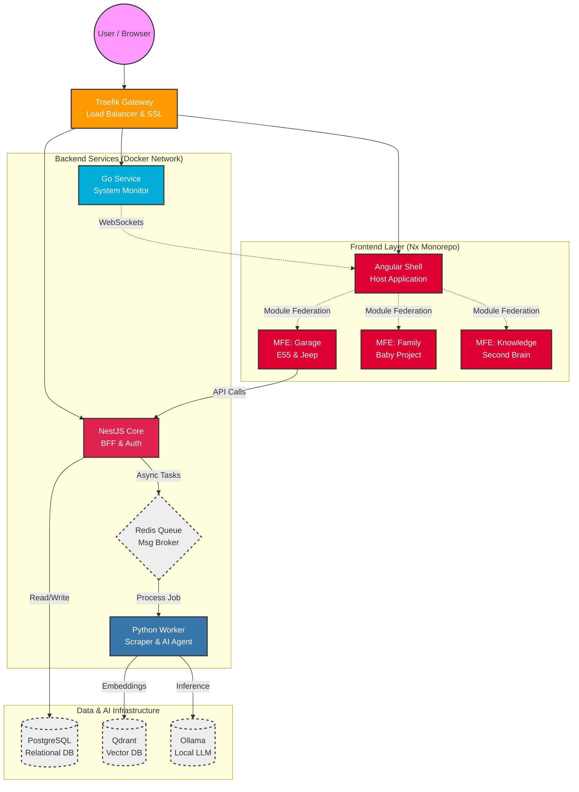

# Project Design Document: LifeOS Nexus Hub

Version: 1.0.0

Primary Goal: A centralized, self-hosted platform to manage automotive projects (Mercedes E55 AMG / Jeep WJ), family logistics (Project Baby), and personal knowledge management using cutting-edge tech.

## 1. High-Level Architecture

The system utilizes a Micro-Frontend architecture for the UI and a Polyglot Microservices architecture for the backend. All services are containerized and orchestrated locally via Docker Compose.

Diagram Concept



## 2. Technology Stack

### Frontend (The "Face")

- **Framework**: **Angular (Latest)**
- **Build System**: Nx Workspace (Monorepo management).
- **Architecture**: Module Federation (Webpack 5 or Native Federation) to load remote modules dynamically.
- **Styling**: Tailwind CSS + Spartan UI (Headless UI primitives, highly customizable, modern look).
- **State Management**: Ngrx or Elf (Reactive state).
- **Key Feature**: AI Canvas – A global, floating side-panel chat interface available in all MFEs, context-aware of the current view.

### Backend (The "Muscle")

- **Core API**: NestJS (TypeScript). Handles auth, user management, and acts as the Backend-For-Frontend (BFF).
- **Data/AI** Service: Python (FastAPI). Handles web scraping (Playwright/BeautifulSoup), data analysis (Pandas), and LLM interaction (LangChain).
- **System** Monitor: Go (Golang). High-performance, low-latency service for monitoring container health and system resources.
- **Gateway**: Traefik. Automatic service discovery, SSL termination, and routing.

### Data & Infrastructure

- **Primary DB**: PostgreSQL (Relational data: tasks, costs, logs).
- **Vector DB**: Qdrant (Storing embeddings for RAG - Retrieval Augmented Generation).
- **Queue**: Redis (Task queues between NestJS and Python).
- **LLM**: Ollama (Running Llama 3 or Mistral locally).
- **Orchestration**: Docker Compose (Dev/Prod).

## 3. Functional Modules

### A. MFE-Garage (Automotive Hub)

**Focus**: Mercedes W211 E55 AMG & Jeep WJ

#### The "Parts Sniper" (Python Scraper)

- **Function**: Automated background agents scraping OLX, Allegro, Otomoto, and eBay.de.
- **Logic**: Watches for specific keywords (e.g., "M113K Kompressor", "Vari-Lok Jeep"). Filters by price deviation (e.g., "Show me items 20% below market average").
- **UI**: A data grid with "Hot Deal" highlighting.

#### Project Kanban & Timeline

- **Function**: Track repairs and upgrades.
- **UI**: Timeline view showing maintenance history with attached photos and costs.

#### Asset Valuation Tracker

- **Function**: Scrapes asking prices of similar E55 AMGs across Europe.
- **UI**: Line chart showing the estimated value of your car vs. total money invested (TCO).

#### Knowledge Base (RAG)

- **Function**: Index PDF service manuals (WIS/ASRA) into Qdrant.
- **Usage**: Ask the AI Canvas: "What is the torque spec for the E55 exhaust manifold?" -> AI retrieves the answer from the PDF.

### B. MFE-Family (Project "Baby")

**Focus**: Logistics & Preparation

#### Smart Procurement Checklist

- **Function**: List of required items (Stroller, Crib, etc.) with priority levels.
- **Integration**: Linked to the "Sniper" to find deals on expensive baby gear.

#### Budget & Expense Tracker

- **Function**: track "Baby CAPEX" vs "OPEX" (Diapers/Formula).

#### Medical & Event Calendar

- **Function**: Vaccination schedules, doctor appointments.

### C. MFE-Knowledge (Second Brain)

**Focus**: Learning & Development

#### Library Manager

- **Function**: Track physical books and e-books. Status: To Read / Reading / Done.

#### Markdown Notes (Obsidian-style)

- **Function**: A clean editor for technical notes.
- **AI Integration**: All notes are vectorized. You can chat with your own knowledge base.

### D. System Monitor (Go Service)

- **Health Check**: Pings all containers and external APIs.
- **Resource Usage**: Visualizes CPU/RAM usage of the host machine (important when running LLMs).
- **Alerts**: Sends WebSocket messages to the Angular Shell if a service goes down.

## 4. Implementation Roadmap

### Phase 1: The Foundation (Weekend 1-2)

- Initialize Nx Workspace (Angular + NestJS preset).
- Set up Docker Compose with Postgres, Redis, and Traefik.
- Create the Shell App (Angular) with basic layout (Tailwind/Spartan UI).
- Implement basic Authentication (can be simple JWT or even Basic Auth initially since it's local).

### Phase 2: The Garage & Scraper (Weekend 3-4)

- Create MFE-Garage (Remote app).
- Build Python Service with FastAPI.
- Implement a basic scraper for OLX (using Playwright).
- Connect NestJS (Commander) to Python (Worker) via Redis Queue.
- Display scraped results in the Angular Grid.

### Phase 3: AI Integration (Weekend 5-6)

- Deploy Ollama and Qdrant containers.
- Create the AI Canvas widget in the Shell.
- Implement the RAG pipeline in Python (Ingest PDF -> Vectorize -> Store).
- Connect the Chat widget to the Python RAG endpoint.

### Phase 4: Expansion (Ongoing)

- Add MFE-Family.
- Build the Go Monitor service.
- (Optional) Migrate to K3s (Kubernetes) if the system becomes stable and you want a challenge.

## 5. Directory Structure Idea (Nx Monorepo)

```text
/lifeos-nexus
├── apps
│   ├── shell (Angular Host)
│   ├── mfe-garage (Angular Remote)
│   ├── mfe-family (Angular Remote)
│   ├── api-core (NestJS)
│   ├── service-scraper (Python)
│   └── service-monitor (Go)
├── libs
│   ├── shared-ui (Spartan UI components)
│   ├── shared-data (Interfaces/DTOs)
│   └── ai-client (Angular service for AI Canvas)
├── tools
│   └── scrapers (Python scripts)
├── docker-compose.yml
└── nx.json
```

## 6. Why

- **Productivity**: It automates the tedious parts of your hobbies (searching for parts).
- **Career Growth**: You are using Module Federation, Vector Databases, and Polyglot Microservices. This is high-level Architect/Principal Engineer stuff.
- **Fun**: You get to play with "toys" (E55 AMG) and "tech" (AI/Docker) simultaneously.
